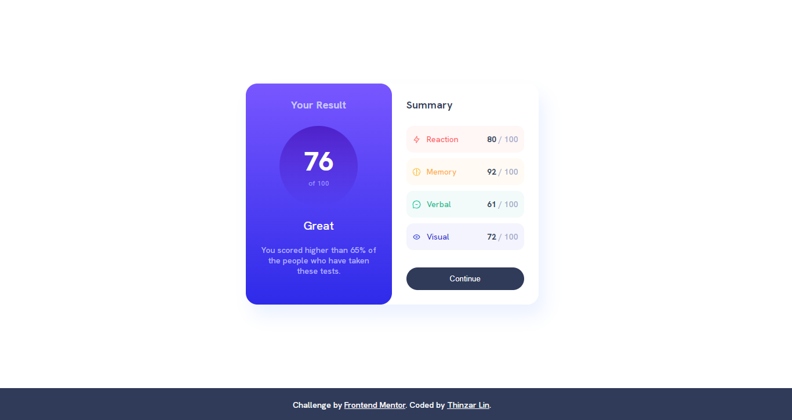

# Frontend Mentor - Results summary component solution

This is a solution to the [Results summary component challenge on Frontend Mentor](https://www.frontendmentor.io/challenges/results-summary-component-CE_K6s0maV). Frontend Mentor challenges help you improve your coding skills by building realistic projects. 

## Table of contents

- [Overview](#overview)
  - [The challenge](#the-challenge)
  - [Screenshot](#screenshot)
  - [Links](#links)
- [My process](#my-process)
  - [Built with](#built-with)
  - [What I learned](#what-i-learned)
  - [Useful resources](#useful-resources)
- [Author](#author)


## Overview

### The challenge

Users should be able to:

- View the optimal layout for the interface depending on their device's screen size
- See hover and focus states for all interactive elements on the page

### Screenshot



### Links

- Solution URL: [Solution](https://github.com/thinzarlin/Results-Summary-Component)
- Live Site URL: [Live Site](https://your-live-site-url.com)

## My process

### Built with

- Semantic HTML5 markup
- CSS custom properties
- CSS Grid
- CSS Box Shadow
- Mobile-first workflow

### What I learned

```css
.container {
    display: grid;
    grid-template: 1fr / 1fr 1fr;
    margin: 10% auto;
    box-shadow: 10px 20px 30px var(--pale-blue);
    max-width: 505px;
    border-radius: 20px;
}
```

### Useful resources

- [Grid Guide](https://css-tricks.com/snippets/css/complete-guide-grid/) - This explains the full concept of CSS grid. This is a good resource. 

## Author

- Github - [Thinzar Lin](https://github.com/thinzarlin)
- Frontend Mentor - [@yourusername](https://www.frontendmentor.io/profile/thinzarlin)

